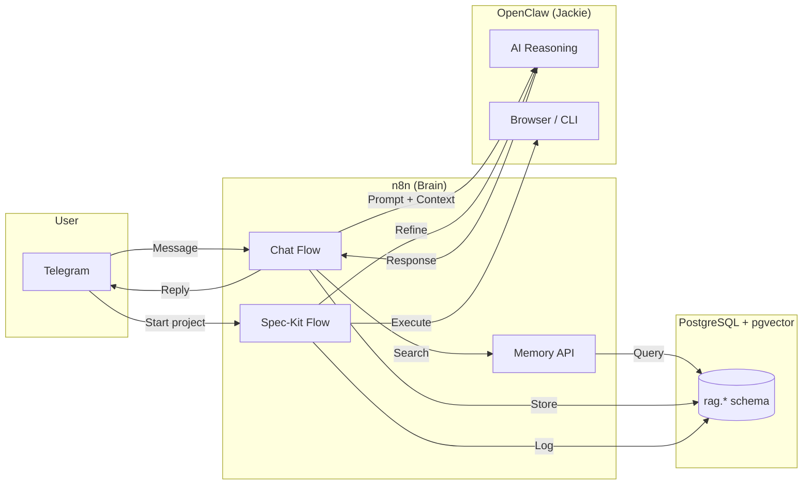

# janAGI — Autonomous Personal AI Agent

**janAGI** is an autonomous AI agent ecosystem powered by **n8n**, **PostgreSQL + pgvector**, and **OpenClaw (Jackie)**.
It runs as a self-hosted stack on **Coolify** (Hostinger VPS) and acts as a personal assistant, project manager,
and knowledge system — all accessible via **Telegram**.

> The name "Jackie" is the AI persona. OpenClaw is the execution engine. n8n is the brain.

---

## What It Does

1. **Telegram Chat with Memory** — Jackie remembers conversations, facts, and context using vector search (RAG).
2. **Spec-Kit Dispatcher** — Jackie can scaffold new software projects: gather requirements, lock specs, delegate implementation to AI coders (Gemini/Copilot), evaluate results, and create PRs. OpenClaw does everything you'd do manually — repo, branches, Spec Kit bootstrap, CLI invocation, PR.
3. **n8n Workflow Builder** — Tell OpenClaw what workflow you need and it generates the n8n JSON, then n8n creates it via its REST API. No manual clicking.
4. **Knowledge Base** — Ingest documents, URLs, and notes into a searchable vector store.
5. **Action Draft Protocol** — For risky operations, Jackie proposes an action draft and waits for human approval via Telegram before executing.

---

## Architecture



---

## Tech Stack

| Component | Technology | Purpose |
|-----------|-----------|---------|
| Orchestrator | n8n (latest) | Workflow automation, webhook API |
| Database | PostgreSQL 16 + pgvector 0.8.x | Vector store, audit log, knowledge base |
| AI Agent | OpenClaw / Jackie | LLM reasoning, browser automation |
| Chat Interface | Telegram Bot | User interaction |
| Hosting | Coolify on Hostinger VPS | Docker stack management |
| Embeddings | OpenAI text-embedding-3-small (1536d) | Semantic search |

---

## Database Schema (`rag.*`)

All data lives in a single Postgres database with the `rag` schema:

- **`rag.clients`** / **`rag.projects`** — Multi-tenant scope
- **`rag.conversations`** — Chat threads (Telegram, CLI, etc.)
- **`rag.runs`** — Agent execution sessions
- **`rag.events`** — Append-only audit log (messages, tool calls, errors)
- **`rag.artifacts`** — Generated files, specs, diffs
- **`rag.sources`** → **`rag.documents`** → **`rag.chunks`** — RAG pipeline (source → document → embedded chunks)

Helper functions: `rag.start_run()`, `rag.log_event()`, `rag.finish_run()`, `rag.search_chunks()`.

Full SQL: [`ops/infra/postgres/init/020_rag_schema.sql`](ops/infra/postgres/init/020_rag_schema.sql)

---

## n8n Workflows

### Core Workflows
| File | Purpose |
|------|---------|
| `main_chat_orchestrator.json` | Telegram → Log → RAG Search → AI Agent → Parse Actions → Reply |
| `memory_workflows.json` | Webhook API: `/memory-upsert` and `/memory-search` |
| `spec_kit_workflow.json` | Spec-Kit: Refine requirements → Lock spec → Execute build |

### Supporting Templates
| File | Purpose |
|------|---------|
| `WF_01_Ingest_Message.json` | Ingest & embed a message into RAG |
| `WF_02_Hunter_Run.json` | Scheduled data collection |
| `WF_03_Analyst_Draft_and_Telegram_Approval.json` | Draft + Telegram approval gate |
| `WF_10_Turbo_OpenClaw_Run.json` | Direct OpenClaw API call |
| `WF_20_Builder_Create_Workflow_via_API.json` | Auto-create n8n workflows via API |

Import instructions: [`ops/docs/WORKFLOWS.md`](ops/docs/WORKFLOWS.md)

---

## Quick Start (Coolify)

### 1. Create Stack in Coolify
Create a new Docker Compose project and paste the contents of `ops/infra/docker-compose.yml`.

### 2. Set Environment Variables
Based on `ops/infra/.env.example`:
- `POSTGRES_PASSWORD` — Database password
- `N8N_ENCRYPTION_KEY` — At least 32 characters
- `OPENAI_API_KEY` — For embeddings
- Telegram Bot Token — Configure in n8n credentials

### 3. Deploy
Coolify handles the rest. The init scripts in `ops/infra/postgres/init/` run automatically on first DB creation.

### 4. Import Workflows
In n8n UI: **Workflows → Import from File** — import the JSON files from `ops/n8n/`.

---

## Networking (Coolify / Docker)

Inside the Docker stack, services reach each other by service name:
- n8n → Postgres: `postgresql:5432` (Coolify managed)
- n8n → OpenClaw: `http://openclaw:18789`
- OpenClaw → n8n: `http://n8n:5678`

**Never use `localhost` or `127.0.0.1`** between containers.

See: [`ops/docs/COOLIFY_EXISTING_RESOURCES.md`](ops/docs/COOLIFY_EXISTING_RESOURCES.md)

---

## Repo Structure

```
janAGI/
├── README.md
├── CONTRIBUTING.md
├── ops/
│   ├── docs/                       # All documentation
│   │   ├── ARCHITECTURE.md
│   │   ├── MEMORY_ARCHITECTURE.md
│   │   ├── DB_SCHEMA.md
│   │   ├── OPENCLAW_DISPATCHER_CONTRACT.md
│   │   ├── OPENCLAW_TURBO.md
│   │   ├── ACTION_DRAFT_PROTOCOL.md
│   │   ├── SPECKIT_OPENCLAW_CLI.md
│   │   ├── WORKFLOWS.md
│   │   ├── SECURITY.md
│   │   └── ...
│   ├── infra/
│   │   ├── docker-compose.yml
│   │   ├── .env.example
│   │   └── postgres/init/         # Auto-run on first DB creation
│   │       ├── 001_extensions.sql
│   │       ├── 020_rag_schema.sql
│   │       └── 030_analytics.sql
│   ├── n8n/
│   │   ├── main_chat_orchestrator.json
│   │   ├── memory_workflows.json
│   │   ├── spec_kit_workflow.json
│   │   ├── snippets/              # Reusable JS/SQL for n8n nodes
│   │   ├── sql/                   # SQL templates for Postgres nodes
│   │   └── workflows/             # Additional workflow templates
│   ├── scripts/
│   │   └── openclaw_spec_execute.sh
│   └── services/
│       └── clawd_worker/          # Optional web scraping worker
└── .gitignore
```

---

## Security

- All secrets via Coolify environment variables (never committed)
- Action Draft protocol requires human approval for destructive actions
- OpenClaw gateway protected by token
- See [`ops/docs/SECURITY.md`](ops/docs/SECURITY.md)

---

## Roadmap

- [x] Database schema with pgvector (rag.*)
- [x] Memory API workflows (upsert/search)
- [x] Main chat orchestrator (Telegram)
- [x] Spec-Kit dispatcher contract
- [ ] Live Telegram bot integration
- [ ] Document ingestion pipeline (URLs, PDFs)
- [ ] Spec-Kit full autopilot (end-to-end)
- [ ] Dashboard UI (bolt.diy or custom)
