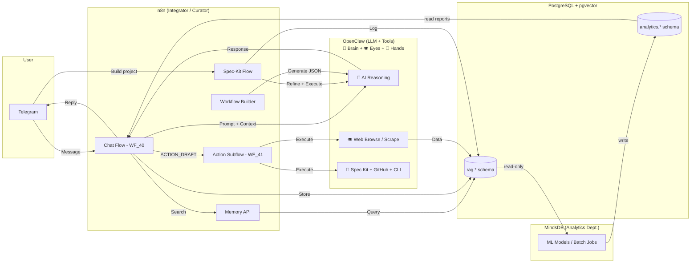

# janAGI — Autonomous Personal AI Agent

**janAGI** is an autonomous AI agent ecosystem powered by **n8n**, **PostgreSQL + pgvector**, and **OpenClaw**.
It runs as a self-hosted stack on **Coolify** (Hostinger VPS) and acts as a personal assistant, project manager,
and knowledge system — all accessible via **Telegram**.

> **Jackie** is the AI agent (persona) that lives in n8n workflows.
> **OpenClaw** is the LLM model powering Jackie — the brain for all AI agents in n8n,
> plus tools for web browsing, scraping, and execution.
> All systems share the same memory (`rag.*` schema in PostgreSQL).

---

## What It Does

1. **Telegram Chat with Memory** — Jackie remembers conversations, facts, and context using vector search (RAG).
2. **Spec-Driven Project Builder** — Jackie uses [Spec Kit](https://github.com/github/spec-kit) (GitHub's spec-driven development toolkit) to properly define new software projects. OpenClaw asks the user what's needed, helps them figure out requirements and constraints, and locks a complete specification. Then it delegates implementation to AI coders (Gemini/Copilot CLI) who receive correct instructions from the start — constitution, spec, plan, tasks, code. No vibe coding.
3. **n8n Workflow Builder** — Tell OpenClaw what workflow you need and it generates the n8n JSON, then n8n creates it via its REST API. No manual clicking.
4. **Knowledge Base** — Ingest documents, URLs, and notes into a searchable vector store.
5. **Action Draft Protocol** — For risky operations, Jackie proposes an action draft and waits for human approval via Telegram before executing.

---

## Architecture



---

## Tech Stack

| Component | Technology | Purpose |
|-----------|-----------|---------|
| Integrator | n8n (latest) | Workflow orchestration, routing, safety gates, webhook API |
| Database | PostgreSQL 16 + pgvector 0.8.x | Vector store, audit log, knowledge base, memory |
| LLM / AI Engine | OpenClaw | 🧠 LLM model for all AI agents in n8n, 👁️ web browsing/scraping, 🤲 project builds, workflow creation |
| Analytics | MindsDB | External BI (multi-source data), internal trends, ML scoring |
| Chat Interface | Telegram Bot | User interaction |
| Hosting | Coolify on Hostinger VPS | Docker stack management |
| Embeddings | OpenAI text-embedding-3-small (1536d) | Semantic search |
| CLI Tools | Gemini CLI, Copilot CLI | Code implementation — receive complete specs from Spec Kit, run `/speckit.*` commands |

---

## Database Schema (`rag.*`)

All business data lives in the `janagi` Postgres database with the `rag` schema:

- **`rag.clients`** / **`rag.projects`** — Multi-tenant scope
- **`rag.conversations`** — Chat threads (Telegram, CLI, etc.)
- **`rag.runs`** — Agent execution sessions (with `summary` + `metadata`)
- **`rag.events`** — Append-only audit log (`actor_type`, `actor_name`, `event_type`, `name`, `payload` jsonb, `ts`)
- **`rag.artifacts`** — Generated outputs (`kind`, `title`, `content_text`, `metadata`)
- **`rag.sources`** → **`rag.documents`** → **`rag.chunks`** — RAG pipeline (source → document → embedded chunks)
- **`analytics.trends_daily`** — Daily topic/keyword aggregation (MindsDB)
- **`analytics.lead_scores`** — ML-scored leads (MindsDB)

Helper functions: `rag.start_run_for_thread()`, `rag.log_event()` (9-arg), `rag.finish_run()`, `rag.search_chunks()`.

Full SQL: [`ops/infra/postgres/init/020_rag_schema.sql`](ops/infra/postgres/init/020_rag_schema.sql) |
Full docs: [`ops/docs/DB_SCHEMA.md`](ops/docs/DB_SCHEMA.md)

---

## n8n Workflows

### Core Workflows
| File | Purpose |
|------|---------|
| `WF_40_Jackie_Telegram_Assistant.json` | **LIVE** — Jackie AI: Telegram → voice/text → history → AI agent → reply or ACTION_DRAFT |
| `WF_41_Jackie_Action_Subflow.json` | **LIVE** — Approved action executor via OpenClaw |
| `memory_workflows.json` | Webhook API: `/memory-upsert` and `/memory-search` |
| `spec_kit_workflow.json` | Spec-Kit: Refine requirements with user → Lock spec → CLI tools execute build |

### Supporting Templates
| File | Purpose |
|------|---------|
| `WF_10_Turbo_OpenClaw_Run.json` | Direct OpenClaw API call |
| `WF_20_Builder_Create_Workflow_via_API.json` | Auto-create n8n workflows via API |
| `WF_30_SpecKit_Full_Build_Parallel.json` | Full parallel build: Gemini + Copilot → winner → PR |

Import instructions: [`ops/docs/WORKFLOWS.md`](ops/docs/WORKFLOWS.md)

---

## Quick Start (Coolify)

### 1. Create Stack in Coolify
Create a new Docker Compose project and paste the contents of `ops/infra/docker-compose.yml`.

### 2. Set Environment Variables
Based on `ops/infra/.env.example`:
- `POSTGRES_PASSWORD` — Database password
- `N8N_ENCRYPTION_KEY` — At least 32 characters
- `OPENAI_API_KEY` — For embeddings
- `MISTRAL_API_KEY` — For LLM (WF_40 uses Mistral)
- Telegram Bot Token — Configure in n8n credentials

### 3. Deploy
Coolify handles the rest. The init scripts in `ops/infra/postgres/init/` run automatically on first DB creation.

### 4. Import Workflows
In n8n UI: **Workflows → Import from File** — import the JSON files from `ops/n8n/`.

---

## Networking (Coolify / Docker)

All services communicate via internal Docker DNS using **stable hostnames**.
Rename Coolify resources to short names for predictable DNS.

| Service | Hostname | Port | Exposed? |
|---------|----------|------|----------|
| PostgreSQL | `postgres` (compose) / `janagi-db` (Coolify) | 5432 | ❌ No |
| n8n | `n8n` | 5678 | ✅ Webhooks (HTTPS) |
| OpenClaw | `openclaw` | 18789 | ❌ No (internal-only) |
| MindsDB | `mindsdb` | 47335 | ❌ No |

Internal routes:
- n8n → Postgres: `postgres:5432` (compose) / `janagi-db:5432` (Coolify)
- n8n → OpenClaw: `http://openclaw:18789`
- n8n → MindsDB: `mindsdb:47335` (MySQL API)
- OpenClaw → n8n: `http://n8n:5678`
- MindsDB → Postgres: `postgres:5432` / `janagi-db:5432` (read-only)

**Never use `localhost` or `127.0.0.1`** between containers.

Verify DNS from any container:
```bash
getent hosts openclaw && ping -c 1 openclaw
```

See: [`ops/docs/COOLIFY_EXISTING_RESOURCES.md`](ops/docs/COOLIFY_EXISTING_RESOURCES.md)

---

## Repo Structure

```
janAGI/
├── README.md
├── CONTRIBUTING.md
├── ops/
│   ├── docs/                       # All documentation
│   │   ├── ARCHITECTURE.md
│   │   ├── MEMORY_ARCHITECTURE.md
│   │   ├── DB_SCHEMA.md
│   │   ├── OPENCLAW_DISPATCHER_CONTRACT.md
│   │   ├── CLI_IMPLEMENTER_CONTRACT.md
│   │   ├── MINDSDB_ANALYTICS.md
│   │   ├── OPENCLAW_TURBO.md
│   │   ├── ACTION_DRAFT_PROTOCOL.md
│   │   ├── SPECKIT_OPENCLAW_CLI.md
│   │   ├── WORKFLOWS.md
│   │   ├── SECURITY.md
│   │   └── ...
│   ├── infra/
│   │   ├── docker-compose.yml
│   │   ├── .env.example
│   │   └── postgres/init/         # Auto-run on first DB creation
│   │       ├── 001_extensions.sql
│   │       ├── 020_rag_schema.sql
│   │       └── 030_analytics.sql
│   ├── n8n/
│   │   ├── main_chat_orchestrator.json  # ⚠️ Legacy (superseded by WF_40)
│   │   ├── memory_workflows.json
│   │   ├── spec_kit_workflow.json
│   │   ├── snippets/              # Reusable JS/SQL for n8n nodes
│   │   ├── sql/                   # SQL templates for Postgres nodes
│   │   └── workflows/             # WF_10–WF_41 templates
│   ├── scripts/
│   │   └── openclaw_spec_execute.sh
│   └── services/
│       └── clawd_worker/          # Optional web scraping worker
└── .gitignore
```

---

## Security

- All secrets via Coolify environment variables (never committed)
- Action Draft protocol requires human approval for destructive actions
- OpenClaw is **internal-only** (no public ports) and protected by auth token
- Separate databases: n8n internal vs. janAGI business data
- See [`ops/docs/SECURITY.md`](ops/docs/SECURITY.md)

---

## Roadmap

- [x] Database schema with pgvector (rag.*)
- [x] Memory API workflows (upsert/search)
- [x] Main chat orchestrator (WF_40 Telegram)
- [x] Action subflow with approval gate (WF_41)
- [x] Spec-Kit spec-driven development contract + CLI implementer contract
- [x] n8n Workflow Builder (API-first)
- [x] MindsDB integration (analytics schema + batch jobs)
- [ ] Live Telegram bot deployment on Coolify
- [ ] Document ingestion pipeline (URLs, PDFs)
- [ ] Spec-Kit full autopilot (end-to-end spec-driven parallel builds)
- [ ] Web scraping data pipelines (social media, competitors)
- [ ] MindsDB external analytics (multi-source BI dashboards)
- [ ] Dashboard UI (bolt.diy or custom)
