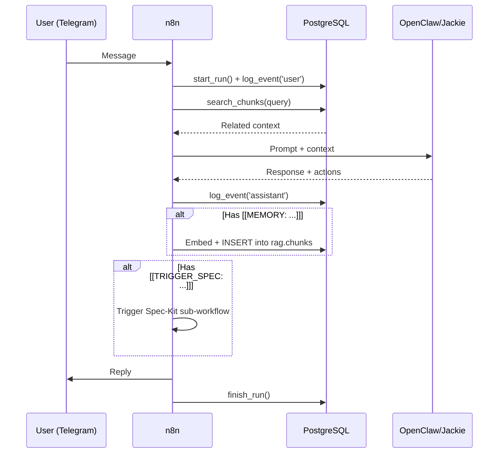

# Architecture

## Vision
janAGI is an autonomous personal AI agent ("Jackie") that operates as a Telegram-accessible assistant
with long-term memory, project management capabilities, and safe action execution.

## Components

### PostgreSQL + pgvector (Data Layer)
Single database hosting all schemas:
- `rag.*` — Core operational data: clients, projects, conversations, runs, events, artifacts, and the RAG vector store (sources → documents → chunks with HNSW index).

Extensions: `vector`, `pgcrypto`, `pg_trgm`, `unaccent`.

### n8n (Orchestration Layer)
Master workflow engine. Three main flows:

1. **Chat Orchestrator** (`main_chat_orchestrator.json`)
   - Telegram Trigger → `rag.start_run()` → `rag.log_event()` → RAG Search → AI Agent → Parse Actions → Reply
   - Automatically extracts facts for memory storage (`[[MEMORY: ...]]`)
   - Can trigger sub-workflows (`[[TRIGGER_SPEC: ...]]`)

2. **Memory API** (`memory_workflows.json`)
   - `POST /webhook/memory-upsert` — Embed + store content into `rag.chunks`
   - `POST /webhook/memory-search` — Embed query + `rag.search_chunks()` → return matches

3. **Spec-Kit Dispatcher** (`spec_kit_workflow.json`)
   - REFINE phase: Gather requirements conversationally → produce `locked.json`
   - EXECUTE phase: Bootstrap repo → run AI implementers → evaluate → create PR

### OpenClaw / Jackie (Agent Layer)
AI reasoning engine with optional browser/CLI tools:
- Receives prompts from n8n with injected RAG context
- Produces structured responses with action tokens
- Can operate autonomously (Spec-Kit) or with human approval (Action Draft)

### Telegram (Interface Layer)
Primary user interface:
- Receives messages, forwards to Chat Orchestrator
- Displays responses, approval buttons
- Supports callback queries for Action Draft protocol

## Data Flow

## Networking (Coolify Docker Stack)

All services communicate via internal Docker DNS:

| From | To | URL |
|------|----|-----|
| n8n | Postgres | `postgresql:5432` |
| n8n | OpenClaw | `http://openclaw:18789` |
| OpenClaw | n8n | `http://n8n:5678` |

**Important**: Never use `localhost` between containers. Coolify manages the network.

## Multi-tenant Support
- Every piece of data is scoped to `client_id` + `project_id`
- Default client: `janagi`, default project: `janagi`
- New tenants = new rows in `rag.clients` / `rag.projects`
