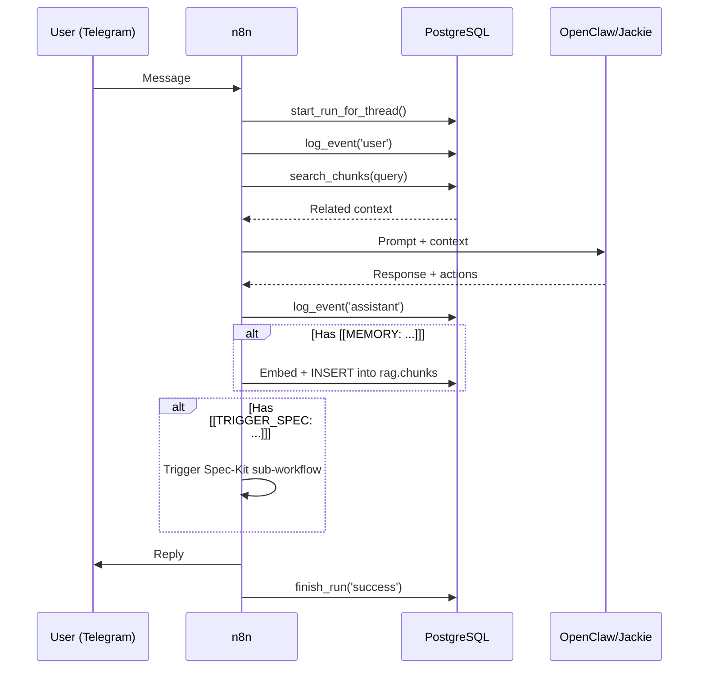

# Architecture

## Vision
janAGI is an autonomous personal AI agent ("Jackie") that operates as a Telegram-accessible assistant
with long-term memory, project management capabilities, and safe action execution.

## Components

### PostgreSQL + pgvector (Data Layer)

**Two logical databases on one Postgres instance:**

| Database | Owner | Purpose |
|----------|-------|---------|
| `janagi` | `janagi` | Domain data: `rag.*` (events, memory, RAG), `analytics.*` (scores, trends) |
| `n8n` (Coolify only) | `n8n` | n8n internal state (workflows, credentials, executions) — **optional separation** |

> **Local dev:** one DB (`janagi`) used by both n8n and business data (n8n uses `public` schema).
> **Coolify prod:** two separate DBs recommended. n8n upgrades can migrate its own DB schema;
> keeping them apart means n8n and janAGI evolve independently.

Schemas in `janagi` DB:
- `rag.*` — Core operational data: clients, projects, conversations, runs, events, artifacts, and the RAG vector store (sources → documents → chunks with HNSW index).
- `analytics.*` — MindsDB-written batch results: lead scores, daily trends.

Extensions: `vector`, `pgcrypto`, `pg_trgm`, `unaccent`.

### n8n (Orchestration Layer)
Master workflow engine. Four main flows:

1. **Chat Orchestrator** (`WF_40_Jackie_Telegram_Assistant.json`)
   - Telegram Trigger → `rag.start_run_for_thread()` → `rag.log_event()` → Load History → AI Agent → Parse Actions → Reply
   - Automatically extracts facts for memory storage (`[[MEMORY: ...]]`)
   - Can trigger sub-workflows (`[[TRIGGER_SPEC: ...]]`) or ACTION_DRAFTs

2. **Memory API** (`memory_workflows.json`)
   - `POST /webhook/memory-upsert` — Embed + store content into `rag.chunks`
   - `POST /webhook/memory-search` — Embed query + `rag.search_chunks()` → return matches

3. **Spec-Kit Dispatcher** (`spec_kit_workflow.json`)
   - REFINE phase: Gather requirements conversationally → produce `locked.json`
   - EXECUTE phase: Bootstrap repo → run AI implementers → evaluate → create PR

4. **Workflow Builder** (via n8n REST API)
   - OpenClaw generates n8n workflow JSON on demand
   - n8n validates + applies it via `POST /api/v1/workflows`
   - Allows OpenClaw to "click workflows" programmatically (API-first)
   - See [N8N_WORKFLOW_BUILDER.md](N8N_WORKFLOW_BUILDER.md)

### OpenClaw / Jackie (Agent Layer)
AI reasoning engine with optional browser/CLI tools:
- Receives prompts from n8n with injected RAG context
- Produces structured responses with action tokens
- Can operate autonomously (Spec-Kit) or with human approval (Action Draft)
- **Handles all operational work** the human would otherwise do manually:
  repo creation, Spec Kit bootstrap, branch management, CLI invocation, PR creation
- **Workflow Builder**: generates n8n workflow JSON and creates workflows via n8n API
- **UI Operator**: can open n8n/other UIs via browser tools (PLAN → APPLY → VERIFY protocol)
- Connects to n8n via `http://n8n:5678` (internal Docker DNS)
- ⚠️ **Internal-only** — no public ports; always behind auth token

#### UI Operator Protocol (PLAN → APPLY → VERIFY)

When OpenClaw operates on a UI (n8n editor, MindsDB, dashboards):

1. **PLAN** — OpenClaw returns what it will do step-by-step, how it verifies success, and what artifacts it exports
2. **APPLY** — Performs the actual UI changes (clicks, fills, submits)
3. **VERIFY** — Re-opens the UI, confirms the end-state matches expectations, exports proof (workflow JSON, screenshot, etc.)

In n8n, add a gate after VERIFY:
- User gets a Telegram report + exported artifact
- One-click "✅ Approve" to activate/deploy the result
- Until approved, the change is staged but not live

See [OPENCLAW_TURBO.md](OPENCLAW_TURBO.md) for HTTP call shapes.

### MindsDB (Analytics Layer)
Batch analytics engine — does **not** interfere with live chat:
- Connects to Postgres as read-only data source (`mindsdb_ro` role)
- Runs scheduled jobs: lead scoring, daily trend detection
- Writes results to `analytics.*` schema
- n8n reads scores/trends and pushes reports to Telegram
- UI on port `47334`, MySQL API on `47335`, HTTP API on `47336`
- See [MINDSDB_ANALYTICS.md](MINDSDB_ANALYTICS.md)

### Telegram (Interface Layer)
Primary user interface:
- Receives messages, forwards to Chat Orchestrator
- Displays responses, approval buttons
- Supports callback queries for Action Draft protocol

## Data Flow



## Networking (Coolify Docker Stack)

All services communicate via internal Docker DNS. **No service should be reachable publicly
except n8n webhooks** (which Coolify proxies via HTTPS).

### Stable Hostnames (Recommended Coolify Resource Names)

| Resource Name | Internal Hostname | Exposed Publicly? |
|---------------|-------------------|-------------------|
| `janagi-db` | `janagi-db` | ❌ No |
| `n8n` | `n8n` | ✅ Yes (webhooks via Coolify proxy) |
| `openclaw` | `openclaw` | ❌ No (internal-only, auth required) |
| `mindsdb` | `mindsdb` | ❌ No (or admin-only) |

> **Tip:** Rename Coolify resources to short names. Coolify uses the resource name
> as the container hostname. Random suffixes like `mindsdb-wc88...` work but are painful to debug.

### Internal DNS Routes

| From | To | URL |
|------|----|-----|
| n8n | janagi DB | `janagi-db:5432` |
| n8n | OpenClaw | `http://openclaw:18789` |
| n8n | MindsDB | `mindsdb:47335` (MySQL API) |
| OpenClaw | n8n | `http://n8n:5678` |
| OpenClaw | n8n API | `http://n8n:5678/api/v1/` |
| MindsDB | janagi DB | `janagi-db:5432` (read-only) |

> `postgres` (docker-compose service name) resolves via Docker DNS.
> In Coolify, rename the Postgres resource to `janagi-db` for the same effect.
> n8n's own internal DB can be a separate database on the same instance (Coolify)
> or the same `janagi` database (docker-compose dev).

### Verify DNS from Inside a Container

```bash
# In Coolify: open Terminal for the n8n container, then:
getent hosts openclaw
getent hosts mindsdb
getent hosts janagi-db
ping -c 1 openclaw
```

If DNS doesn't resolve, the services are not in the same Docker network
or the resource name doesn't match. Fix in Coolify → Settings → Networks.

**Important**: Never use `localhost` between containers. Coolify manages the network.

## Multi-tenant Support
- Every piece of data is scoped to `client_id` + `project_id`
- Default client: `janagi`, default project: `janagi`
- New tenants = new rows in `rag.clients` / `rag.projects`

## Agent Architecture Pattern

The system follows a **"one main assistant + specialized sub-workflows"** pattern:

```
┌──────────────────────────────────────────────┐
│              Jackie (Main Assistant)          │
│  Telegram ↔ AI Agent ↔ History ↔ Memory      │
│                                              │
│  Decides: answer directly OR delegate        │
├──────────────┬───────────────┬───────────────┤
│ Sub-WF: Web  │ Sub-WF: Spec  │ Sub-WF: WF    │
│ (OpenClaw    │ (Spec-Kit     │ (Workflow      │
│  fetch/      │  build/       │  Builder via   │
│  browse)     │  implement)   │  n8n API)      │
├──────────────┼───────────────┼───────────────┤
│ Sub-WF:      │ Sub-WF:       │ Sub-WF:        │
│ Email/Tasks  │ CLI Repair    │ Analytics      │
│ (disabled)   │               │ (MindsDB read) │
└──────────────┴───────────────┴───────────────┘
```

OpenClaw is connected as a **skill/tool** — either:
- Directly in the main agent as an HTTP tool call, or
- As a separate sub-workflow (`WF_41`) that the main agent triggers via ACTION_DRAFT
