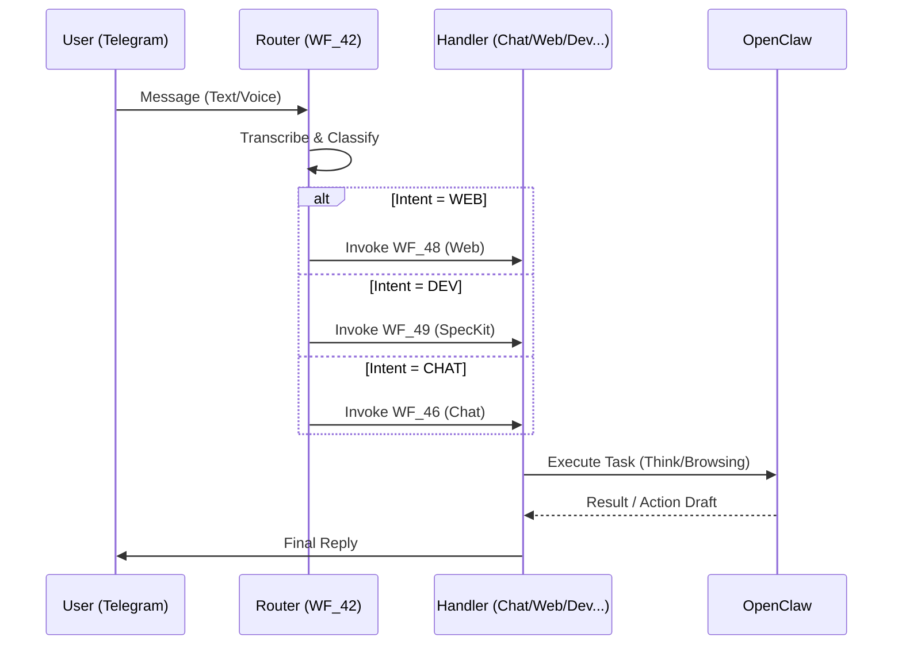
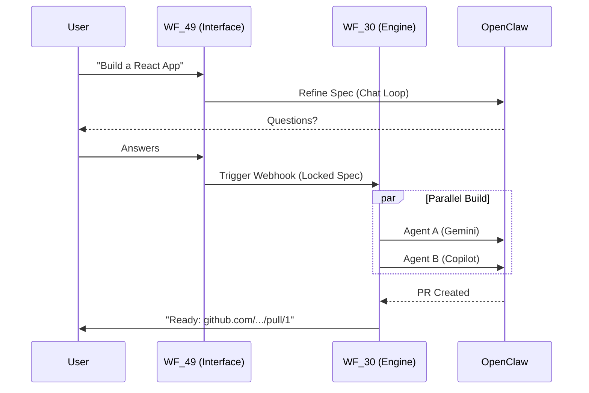

# Architecture

## Vision

janAGI is an autonomous AI agent ecosystem where **[n8n](https://github.com/n8n-io/n8n)** acts as the
**integrator and curator** — it’s a fair-code workflow automation platform
with native AI capabilities (LangChain-based AI agents, 400+ integrations,
JS/Python code support) that orchestrates all processes through fixed workflows
and uses **[OpenClaw](https://docs.openclaw.ai/)** as the AI agent gateway.

**Key Philosophy:**
n8n is the "Central Nervous System" (Router) and OpenClaw provides the "Brain," "Eyes," and "Hands."

**OpenClaw** is a self-hosted gateway that provides:
- **Think (Brain)** — LLM reasoning, decision-making, conversation with memory.
- **See (Eyes)** — browse websites, read social media, monitor trends.
- **Act (Hands)** — build software (Spec Kit), execute CLI tools, automate n8n.

**[MindsDB](https://github.com/mindsdb/mindsdb)** acts as the **Analytics & BI Layer**, connecting external data sources and providing operational insights.

---

## Evolution of Architecture

### V1: The Monolith (Legacy)
Initially, `WF_40` handled everything. A single AI Agent node tried to manage chat, web searching, and project building. This became hard to maintain and debug.

### V2: The Router (Current)
We evolved to a **Micro-Workflow** architecture centered on `WF_42` (Classifier Router).
1.  **Ingest:** Standardize input.
2.  **Classify:** A specialized LLM call determines if the intent is `CHAT`, `WEB`, `MEETING`, `TASK`, or `DEV`.
3.  **Route:** Control is passed to a dedicated handler workflow (e.g., `WF_48` for Web).
4.  **Execute:** The handler performs the task (using OpenClaw/Tools) and replies.

This modular approach allows us to upgrade the "Web Researcher" without breaking the "Calendar Manager."

---

## Components

### PostgreSQL + pgvector (Data Layer)

**Two logical databases on one Postgres instance:**

| Database | Owner | Purpose |
|----------|-------|---------|
| `janagi` | `janagi` | Domain data: `rag.*` (events, memory, RAG), `analytics.*` (scores, trends) |
| `n8n` | `n8n` | n8n internal state (workflows, credentials, executions) |

Schemas in `janagi` DB:
- `rag.*` — Core operational data: projects, conversations, runs, events, artifacts, vector store.
- `analytics.*` — MindsDB-written batch results.

### n8n (Integrator / Curator)

Functions as the traffic controller. It delegates intelligence to OpenClaw.

**Core Workflows (V2 Router):**

1.  **Ingestion & Routing**
    *   **Ingest** (`WF_01`): Standardizes inputs.
    *   **Router / Brain** (`WF_42_Jackie_Classifier`): The entry point. Classifies intent and routes to handlers.

2.  **Specialized Handlers (The "Limbs")**
    *   **Chat** (`WF_46`): General conversation + RAG.
    *   **Productivity** (`WF_43` Meeting, `WF_44` Task, `WF_45` Email).
    *   **Web Intel** (`WF_48` Web): Browsing and research agent.
    *   **Dev / Builder** (`WF_49` SpecKit): Software architect interface.

3.  **Execution & Ops**
    *   **Action Executor** (`WF_41`): Handles approved valid actions.
    *   **Spec Engine** (`WF_30`): The implementation engine for software builds.
    *   **System Builder** (`WF_20`): Automates n8n workflow creation.

### OpenClaw (AI Agent Gateway)

Internal API: `http://openclaw:18789`. Used by n8n via `/v1/responses`.

**Capabilities:**
- **Web Intelligence:** Deep research, scraping (used by `WF_48`).
- **Software Building:** Orchestrates the "Spec Kit" lifecycle (used by `WF_30`/`WF_49`).
- **UI Automation:** Robust "Plan/Apply/Verify" for web UIs.

### Telegram (Interface)
The unified front-end. Supports:
- Voice messages (transcribed by Gemini in `WF_42`).
- Text interaction.
- Approval Buttons (Action Draft Protocol).

---

## Data Flow

### The V2 Router Architecture

### Software Build Flow (Dev Capability)

## Networking

| Service | Internal Hostname | Exposed? |
|---------|-------------------|----------|
| `janagi-db` | `janagi-db` | No |
| `n8n` | `n8n` | Yes (Webhooks) |
| `openclaw` | `openclaw` | No |
| `mindsdb` | `mindsdb` | No |

All communication occurs via the internal Docker network.
