# Architecture

## Vision

janAGI is an autonomous AI agent ecosystem where **n8n** acts as the
**integrator and curator** — it orchestrates all processes through fixed workflows
and uses **OpenClaw** as the **LLM model** powering its AI agents.

**Jackie** is the AI agent persona that lives in n8n workflows. **OpenClaw** is
the LLM engine behind Jackie — the brain for AI agents in n8n, plus the provider
of tools for web browsing, scraping, and execution. All systems share the same
memory (`rag.*` schema in PostgreSQL).

OpenClaw provides:
- **Think** — LLM reasoning, decision-making, conversation with memory
- **See** — browse websites, read social media, scrape content
- **Act** — build software projects using [Spec Kit](https://github.com/github/spec-kit)
  (GitHub's spec-driven development toolkit), delegate implementation to
  CLI tools (Gemini, Copilot), create and modify n8n workflows via API

**MindsDB** serves as the **analytics department** — primarily for external
business intelligence (combining data from multiple sources: browsing behavior,
purchases, social interactions, CRM) and secondarily for internal operational
analytics (conversation trends, usage patterns).

The user interacts with the system via **Telegram**. Everything runs as a
self-hosted Docker stack on **Coolify** (Hostinger VPS).

---

## Components

### PostgreSQL + pgvector (Data Layer)

**Two logical databases on one Postgres instance:**

| Database | Owner | Purpose |
|----------|-------|---------|
| `janagi` | `janagi` | Domain data: `rag.*` (events, memory, RAG), `analytics.*` (scores, trends) |
| `n8n` (Coolify only) | `n8n` | n8n internal state (workflows, credentials, executions) — **optional separation** |

> **Local dev:** one DB (`janagi`) used by both n8n and business data (n8n uses `public` schema).
> **Coolify prod:** two separate DBs recommended. n8n upgrades can migrate its own DB schema;
> keeping them apart means n8n and janAGI evolve independently.

Schemas in `janagi` DB:
- `rag.*` — Core operational data: clients, projects, conversations, runs, events, artifacts, and the RAG vector store (sources → documents → chunks with HNSW index).
- `analytics.*` — MindsDB-written batch results: lead scores, daily trends.

Extensions: `vector`, `pgcrypto`, `pg_trgm`, `unaccent`.

### n8n (Integrator / Curator)

n8n is the **integrator and curator** — it does NOT think or act on its own.
It coordinates all processes through fixed workflows and delegates intelligence
to OpenClaw. Think of n8n as a traffic controller: it routes requests, manages
state (DB logging), enforces safety gates (Action Draft), and triggers the right
sub-workflow at the right time.

**Core workflows:**

1. **Chat Orchestrator** (`WF_40_Jackie_Telegram_Assistant.json`)
   - Telegram Trigger → `rag.start_run_for_thread()` → `rag.log_event()` → Load History → AI Agent → Parse Actions → Reply
   - Automatically extracts facts for memory storage (`[[MEMORY: ...]]`)
   - Can trigger sub-workflows (`[[TRIGGER_SPEC: ...]]`) or ACTION_DRAFTs
   - OpenClaw provides the reasoning; n8n routes the result

2. **Action Subflow** (`WF_41_Jackie_Action_Subflow.json`)
   - Executes approved actions via OpenClaw `/v1/responses`
   - Web browsing, scraping, social media reading, any external action
   - Logs artifacts and results back to DB

3. **Memory API** (`memory_workflows.json`)
   - `POST /webhook/memory-upsert` — Embed + store content into `rag.chunks`
   - `POST /webhook/memory-search` — Embed query + `rag.search_chunks()` → return matches

4. **Spec-Kit Dispatcher** (`spec_kit_workflow.json`)
   - Uses [Spec Kit](https://github.com/github/spec-kit) methodology: OpenClaw
     asks the user spec-driven questions (what to build, constraints, acceptance
     criteria) and helps them figure out what they need
   - REFINE phase: Gather requirements conversationally → produce `locked.json`
   - EXECUTE phase: Bootstrap repo with `specify init`, CLI tools run
     `/speckit.*` slash commands → constitution → spec → plan → tasks → code
   - Result: CLI tools start with proper, complete specifications — no vibe coding

5. **Workflow Builder** (`WF_20_Builder_Create_Workflow_via_API.json`)
   - OpenClaw generates n8n workflow JSON on demand
   - n8n validates + applies it via `POST /api/v1/workflows`
   - Allows OpenClaw to create/modify n8n workflows programmatically
   - See [N8N_WORKFLOW_BUILDER.md](N8N_WORKFLOW_BUILDER.md)

6. **Analytics Reader** (planned)
   - n8n reads `analytics.*` tables (written by MindsDB) and pushes
     reports/insights to Telegram or dashboards

### OpenClaw (LLM + Tools = Brain + Hands + Eyes)

OpenClaw is the **LLM model** powering all AI agents in n8n. **Jackie** is the
name of the main agent persona — she lives in n8n workflows and uses OpenClaw
as her LLM backend. OpenClaw also provides built-in tools for web browsing,
scraping, and execution.

All systems share the same memory: the `rag.*` schema in PostgreSQL. n8n reads/writes
it via SQL, OpenClaw accesses it via n8n webhook APIs (`/webhook/memory-upsert`,
`/webhook/memory-search`).

n8n calls OpenClaw whenever it needs thinking, seeing, or acting.

**🧠 Brain (Reasoning):**
- LLM-powered reasoning and decision-making
- Conversational AI with injected RAG context and memory
- Produces structured responses with action tokens
- Decides when to answer directly, browse the web, or trigger a project build

**👁️ Eyes (Web Intelligence):**
- Browse any website, read and extract content
- Scrape social media (Twitter/X, LinkedIn, news sites, forums)
- Monitor competitor activity, market trends, news
- Fetch and summarize web pages on demand
- Data collection for MindsDB analytics pipeline

**🤲 Hands (Execution):**
- **Spec Kit + GitHub**: Uses [Spec Kit](https://github.com/github/spec-kit)
  (GitHub's spec-driven development toolkit) to properly define projects —
  OpenClaw asks the user the right questions, helps them figure out requirements,
  locks a complete specification, then delegates implementation to CLI tools
  (Gemini CLI, Copilot CLI) which receive correct instructions from the start.
  OpenClaw evaluates results and creates PRs
- **n8n Workflow Builder**: Generate workflow JSON, create/modify/activate
  workflows via n8n REST API — no manual UI clicking needed
- **UI Operator**: PLAN → APPLY → VERIFY protocol for any web UI
  (n8n editor, MindsDB, admin panels)
- **Action Draft Protocol**: For risky actions, proposes a draft and waits
  for human approval via Telegram before executing

**Connection:** `http://openclaw:18789` (internal Docker DNS)
⚠️ **Internal-only** — no public ports; always behind auth token

#### UI Operator Protocol (PLAN → APPLY → VERIFY)

When OpenClaw operates on a UI (n8n editor, MindsDB, dashboards):

1. **PLAN** — OpenClaw returns what it will do step-by-step, how it verifies success, and what artifacts it exports
2. **APPLY** — Performs the actual UI changes (clicks, fills, submits)
3. **VERIFY** — Re-opens the UI, confirms the end-state matches expectations, exports proof (workflow JSON, screenshot, etc.)

In n8n, add a gate after VERIFY:
- User gets a Telegram report + exported artifact
- One-click "✅ Approve" to activate/deploy the result
- Until approved, the change is staged but not live

See [OPENCLAW_TURBO.md](OPENCLAW_TURBO.md) for HTTP call shapes.

### MindsDB (Analytics Department)

MindsDB is the **analytics department** — a background processor that does
**not** interfere with live chat. It has two primary missions:

**1. External Business Intelligence (primary purpose):**
- Combine data from multiple sources: web scraping results, purchase/e-commerce
  data, social media interactions, CRM data, browsing behavior
- Aggregate and score leads, customers, market signals
- Build ML models over combined datasets (`CREATE MODEL ... PREDICT ...`)
- Power dashboards and automated reports

**2. Internal Operational Analytics:**
- Conversation trend detection (daily topic/keyword aggregation)
- Usage patterns and engagement metrics
- Memory optimization signals (what to keep, what to archive)

**How it works:**
- Connects to Postgres as read-only data source (`mindsdb_ro` role)
- OpenClaw feeds external data (scraped content, browsing data) into
  `rag.events` / `rag.artifacts` via n8n workflows
- MindsDB scheduled jobs process this data into `analytics.*` tables
- n8n reads `analytics.*` and pushes reports/insights to Telegram
- UI on port `47334`, MySQL API on `47335`, HTTP API on `47336`
- See [MINDSDB_ANALYTICS.md](MINDSDB_ANALYTICS.md)

### Telegram (Interface Layer)
Primary user interface:
- Receives messages, forwards to Chat Orchestrator
- Displays responses, approval buttons
- Supports callback queries for Action Draft protocol

## Data Flow

### Chat with Memory (WF_40)


### Web Intelligence Flow (WF_41)


### Project Build Flow (Spec Kit)

```mermaid
sequenceDiagram
    participant U as User (Telegram)
    participant N as n8n (Integrator)
    participant AI as OpenClaw (Brain+Hands)
    participant CLI as CLI Tools (Gemini/Copilot)
    participant GH as GitHub

    U->>N: "Build me a FastAPI app for..."
    N->>AI: REFINE (Spec-Kit questions)
    AI-->>N: Questions
    N->>U: Questions via Telegram
    U->>N: Answers
    N->>AI: Lock spec → locked.json
    AI->>GH: Create repo, specify init
    AI->>CLI: Invoke with locked.json + DoD
    CLI->>GH: Commits (constitution→spec→plan→tasks→code)
    CLI-->>AI: Status (green/red)
    AI->>GH: Evaluate, pick winner, create PR
    AI-->>N: Result + PR URL
    N->>U: "✅ PR ready: github.com/.../pull/1"
```



## Networking (Coolify Docker Stack)

All services communicate via internal Docker DNS. **No service should be reachable publicly
except n8n webhooks** (which Coolify proxies via HTTPS).

### Stable Hostnames (Recommended Coolify Resource Names)

| Resource Name | Internal Hostname | Exposed Publicly? |
|---------------|-------------------|-------------------|
| `janagi-db` | `janagi-db` | ❌ No |
| `n8n` | `n8n` | ✅ Yes (webhooks via Coolify proxy) |
| `openclaw` | `openclaw` | ❌ No (internal-only, auth required) |
| `mindsdb` | `mindsdb` | ❌ No (or admin-only) |

> **Tip:** Rename Coolify resources to short names. Coolify uses the resource name
> as the container hostname. Random suffixes like `mindsdb-wc88...` work but are painful to debug.

### Internal DNS Routes

| From | To | URL |
|------|----|-----|
| n8n | janagi DB | `janagi-db:5432` |
| n8n | OpenClaw | `http://openclaw:18789` |
| n8n | MindsDB | `mindsdb:47335` (MySQL API) |
| OpenClaw | n8n | `http://n8n:5678` |
| OpenClaw | n8n API | `http://n8n:5678/api/v1/` |
| MindsDB | janagi DB | `janagi-db:5432` (read-only) |

> `postgres` (docker-compose service name) resolves via Docker DNS.
> In Coolify, rename the Postgres resource to `janagi-db` for the same effect.
> n8n's own internal DB can be a separate database on the same instance (Coolify)
> or the same `janagi` database (docker-compose dev).

### Verify DNS from Inside a Container

```bash
# In Coolify: open Terminal for the n8n container, then:
getent hosts openclaw
getent hosts mindsdb
getent hosts janagi-db
ping -c 1 openclaw
```

If DNS doesn't resolve, the services are not in the same Docker network
or the resource name doesn't match. Fix in Coolify → Settings → Networks.

**Important**: Never use `localhost` between containers. Coolify manages the network.

## Multi-tenant Support
- Every piece of data is scoped to `client_id` + `project_id`
- Default client: `janagi`, default project: `janagi`
- New tenants = new rows in `rag.clients` / `rag.projects`

## Agent Architecture Pattern

The system follows a **"n8n integrates, OpenClaw is the LLM"** pattern.
All systems share the same memory (`rag.*` in PostgreSQL).

```
┌──────────────────────────────────────────────────────────┐
│   n8n (Integrator / Curator)                            │
│   Telegram ↔ DB logging ↔ Safety gates ↔ Routing         │
│   AI Agent node uses OpenClaw as LLM model              │
│   Decides NOTHING — routes to the right sub-workflow     │
├──────────────────────────────────────────────────────────┤
│                  OpenClaw (LLM + Tools)                  │
│             (🧠 Brain + 👁️ Eyes + 🤲 Hands)                  │
│             Jackie = agent persona in n8n                │
├──────────────┬───────────────┬──────────────┬─────────────┤
│ 🧠 Chat &    │ 👁️ Web        │ 🤲 Spec Kit  │ 🤲 Workflow  │
│ Reasoning   │ Browse /     │ (Spec-     │ Builder    │
│ (LLM +      │ Scrape /     │ Driven     │ (n8n API)  │
│  Memory)    │ Social Media │ Dev)       │            │
├──────────────┼───────────────┼──────────────┼─────────────┤
│              │               │              │             │
│ CLI Tools:   │ Data feeds:   │ Gemini CLI   │ n8n REST    │
│ (Gemini,     │ → rag.events  │ Copilot CLI  │ API         │
│  Copilot)    │ → rag.artifacts│              │             │
└──────────────┴───────────────┴──────────────┴─────────────┘
                        │
              ┌─────────┴──────────┐
              │ MindsDB              │
              │ (Analytics Dept.)    │
              │                      │
              │ External: combine    │
              │ browsing + purchases │
              │ + social → insights  │
              │                      │
              │ Internal: trends,    │
              │ usage, lead scores   │
              └──────────────────────┘
```

OpenClaw is the **sole LLM** — either:
- Directly in the main AI Agent node as the LLM model, or
- As a separate sub-workflow (`WF_41`) that the main agent triggers via ACTION_DRAFT

n8n **never thinks** — it only integrates, logs, gates, and routes.
All systems share the same memory (`rag.*` schema in PostgreSQL).
