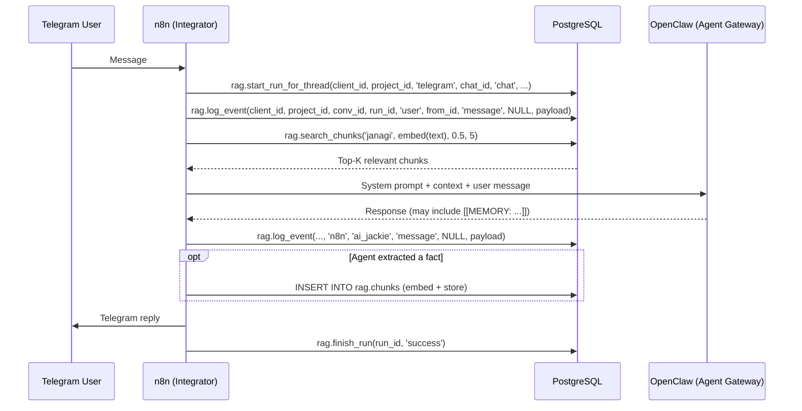

# Memory Architecture

## Overview

janAGI uses a **unified memory system** built on PostgreSQL + pgvector.
All data flows through the `rag.*` schema — there is no separate `chat.*` schema.
**All systems share this memory**: n8n reads/writes via SQL, OpenClaw accesses
it via n8n webhook APIs, MindsDB reads it for analytics.

- **Short-term memory**: `rag.events` (append-only message log per conversation)
- **Long-term memory**: `rag.chunks` (embedded text for semantic search)
- **Artifacts**: `rag.artifacts` (generated files, specs, results)

Full column definitions: [DB_SCHEMA.md](DB_SCHEMA.md)

## Memory Access Patterns

### From n8n (Integrator → Direct SQL)
n8n (as the integrator) uses Postgres nodes to call stored functions:
- `rag.start_run_for_thread()` — Initialize a session (resolves/creates conversation)
- `rag.log_event()` — Record messages, tool calls, errors (9-arg version)
- `rag.search_chunks()` — Semantic search over knowledge base
- `rag.finish_run()` — Close session (with optional summary + metadata)

### From OpenClaw (Agent Gateway → via n8n Webhooks)
OpenClaw (the AI agent gateway running Jackie) cannot access the database
directly. It uses HTTP webhooks provided by n8n:
- `POST /webhook/memory-upsert` — Store new knowledge (e.g. scraped web data, facts)
- `POST /webhook/memory-search` — Query existing knowledge before making decisions

## Workflow: Chat with Memory



## Workflow: Memory Upsert (Webhook API)

**Endpoint**: `POST /webhook/memory-upsert`

```json
{
  "content": "Coolify requires pgvector image for vector support.",
  "namespace": "janagi",
  "metadata": { "source": "chat_extraction", "chat_id": "123" }
}
```

**Process**:
1. Receive content via webhook
2. Generate embedding via OpenAI `text-embedding-3-small` (1536 dimensions)
3. Format embedding array as string for pgvector
4. `INSERT INTO rag.chunks` with project lookup by namespace

## Workflow: Memory Search (Webhook API)

**Endpoint**: `POST /webhook/memory-search`

```json
{
  "query": "How do I deploy on Coolify?",
  "namespace": "janagi",
  "top_k": 5
}
```

**Process**:
1. Embed query text
2. Call `rag.search_chunks(namespace, embedding, 0.5, top_k)`
3. Return ranked results with similarity scores

## Action Parsing

The AI Agent can embed structured commands in its response:
- `[[MEMORY: some fact]]` — Triggers memory upsert
- `[[TRIGGER_SPEC: project-name]]` — Triggers Spec-Kit sub-workflow

The n8n Code Node parses these tokens and routes accordingly.

## RAG Index Structure

```
rag.sources (where data comes from)
  └── rag.documents (parent units, deduplicated by hash)
       └── rag.chunks (embedded text fragments, searchable)
```

Each chunk has:
- `content` — The actual text
- `embedding` — 1536-dimension vector (HNSW indexed)
- `metadata` — JSONB for tags, source info, timestamps
- `chunk_index` — Position within parent document
