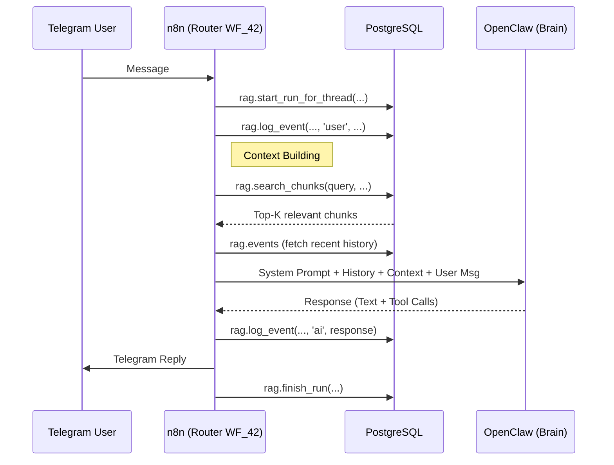

# Memory Architecture

## Overview

janAGI uses a **unified memory system** built on PostgreSQL + pgvector.
All data flows through the `rag.*` schema — there is no separate `chat.*` schema.
**All systems share this memory**: n8n reads/writes via SQL, OpenClaw accesses
it via n8n webhook APIs, MindsDB connects to it as a federated data source for
analytics and data unification.

- **Short-term memory**: `rag.events` (append-only message log per conversation)
- **Long-term memory**: `rag.chunks` (embedded text for semantic search)
- **Artifacts**: `rag.artifacts` (generated files, specs, results)

Full column definitions: [DB_SCHEMA.md](DB_SCHEMA.md)

## Memory Access Patterns

### 1. From n8n (Integrator → Direct SQL)
n8n is the **Orchestrator**. It holds the database credentials and manages the session lifecycle.
- **Read:** Before calling the AI, n8n executes `rag.search_chunks()` and `SELECT FROM rag.events` to build the context window.
- **Write:** When the AI responds, n8n executes `rag.log_event()` to append the turn to the log.
- **Integration:** No HTTP API is required. Standard "Postgres" nodes in n8n are sufficient.

### 2. From MindsDB (Analytics → Direct SQL)
MindsDB is the **Analyst**. It connects directly to the PostgreSQL instance as a standard data source.
- **Read:** It queries `rag.events` to analyze trends and `rag.chunks` to understand knowledge coverage.
- **Write:** It writes computed insights to `analytics.*` tables.
- **Integration:** Standard SQL Federation (Connect to Postgres).

### 3. From OpenClaw (Brain → via n8n Context)
OpenClaw is the **Reasoning Engine**. In this V2 architecture, it is effectively **stateless** regarding long-term retention.
- **Internal Memory Integration:** OpenClaw's internal memory (if enabled via config) should be **disabled** or treated as ephemeral.
- **Single Source of Truth:** The `rag.*` schema is the only authoritative memory. OpenClaw relies 100% on the context provided by n8n in the `messages` array.
- **Integration:** n8n acts as the memory driver for OpenClaw. OpenClaw does not connect to the DB directly.

## Workflow: Chat with Memory (V2 Router)



## Memory Management (Future)

Future implementations (`WF_4X` series) will enable the agent to explicitly call tools to store "permanent facts" into `rag.chunks`. For now, all conversation history is automatically indexed in `rag.events`.

## Action Parsing

The AI Agent returns structured tool calls (OpenAI/Anthropic standard) or structured JSON. The "Magic Brackets" `[[MEMORY:...]]` syntax is deprecated in favor of explicit tool definitions.

## RAG Index Structure

```
rag.sources (where data comes from)
  └── rag.documents (parent units, deduplicated by hash)
       └── rag.chunks (embedded text fragments, searchable)
```

Each chunk has:
- `content` — The actual text
- `embedding` — 1536-dimension vector (HNSW indexed)
- `metadata` — JSONB for tags, source info, timestamps
- `chunk_index` — Position within parent document
