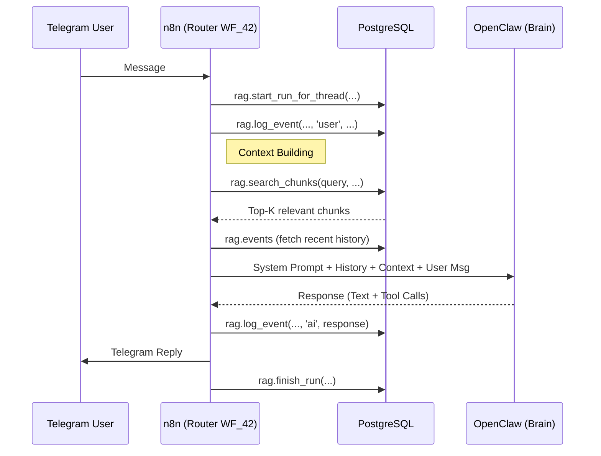

# Memory Architecture

## Overview

janAGI uses a **unified memory system** built on PostgreSQL + pgvector.
All data flows through the `rag.*` schema — there is no separate `chat.*` schema.
**All systems share this memory**: n8n reads/writes via SQL, OpenClaw accesses
it via n8n webhook APIs, MindsDB connects to it as a federated data source for
analytics and data unification.

- **Short-term memory**: `rag.events` (append-only message log per conversation)
- **Long-term memory**: `rag.chunks` (embedded text for semantic search)
- **Artifacts**: `rag.artifacts` (generated files, specs, results)

Full column definitions: [DB_SCHEMA.md](DB_SCHEMA.md)

## Memory Access Patterns

### From n8n (Integrator → Direct SQL)
n8n (as the integrator) uses Postgres nodes to call stored functions:
- `rag.start_run_for_thread()` — Initialize a session (resolves/creates conversation)
- `rag.log_event()` — Record messages, tool calls, errors (9-arg version)
- `rag.search_chunks()` — Semantic search over knowledge base
- `rag.finish_run()` — Close session (with optional summary + metadata)

### From OpenClaw (Agent Gateway)
In the V2 architecture, OpenClaw runs as a stateless "Brain". It does not access the database directly or via webhooks. Instead, **n8n (the Router)** is responsible for:
1.  **Retrieval:** Fetching relevant context via `rag.search_chunks()` *before* calling the agent.
2.  **Storage:** Logging the conversation to `rag.events`.
3.  **Upsert:** Long-term memory storage is currently handled by n8n workflows (e.g. `WF_34` or manual tools), not by the agent directly calling webhooks.

## Workflow: Chat with Memory (V2 Router)



## Memory Management (Future)

Future implementations (`WF_4X` series) will enable the agent to explicitly call tools to store "permanent facts" into `rag.chunks`. For now, all conversation history is automatically indexed in `rag.events`.

## Action Parsing

The AI Agent returns structured tool calls (OpenAI/Anthropic standard) or structured JSON. The "Magic Brackets" `[[MEMORY:...]]` syntax is deprecated in favor of explicit tool definitions.

## RAG Index Structure

```
rag.sources (where data comes from)
  └── rag.documents (parent units, deduplicated by hash)
       └── rag.chunks (embedded text fragments, searchable)
```

Each chunk has:
- `content` — The actual text
- `embedding` — 1536-dimension vector (HNSW indexed)
- `metadata` — JSONB for tags, source info, timestamps
- `chunk_index` — Position within parent document
