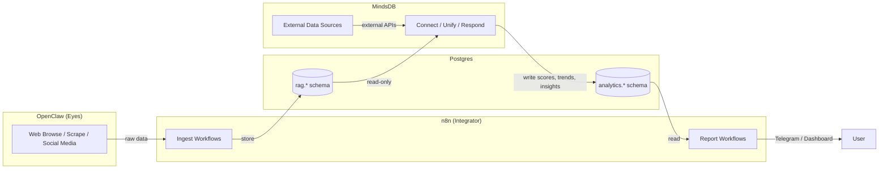

# MindsDB — Federated Query Engine for AI

[MindsDB](https://github.com/mindsdb/mindsdb) is a **Federated Query Engine for AI** —
it connects hundreds of data sources (databases, APIs, SaaS apps), unifies them
via knowledge bases and views (no-ETL), and responds from the unified data
via built-in agents and a built-in MCP server. Its core philosophy:
**Connect → Unify → Respond.**

In janAGI, MindsDB has two missions:

1. **External Data Federation & BI (primary)** — connect and unify data from multiple
   sources (web scraping, social media, purchases, CRM, browsing behavior) into
   actionable insights, ML-scored leads, and automated reports.
2. **Internal Operational Analytics** — conversation trend detection, usage patterns,
   engagement metrics from janAGI’s own `rag.*` data.

MindsDB does **not** interfere with live chat; it operates as a scheduled background processor.

---

## How It Fits Together

The data pipeline works like this:
1. **OpenClaw (eyes)** browses websites, scrapes social media, fetches competitor data
2. **n8n workflows** store this raw data in `rag.events` / `rag.artifacts` (PostgreSQL)
3. **MindsDB** connects to `rag.*` + external sources, unifies them via knowledge bases
   and views (no-ETL), runs ML models/jobs, and writes results to `analytics.*`
4. **n8n workflows** read `analytics.*` and push reports/insights to Telegram

---

## What MindsDB Does

### Core Capabilities (Connect → Unify → Respond)

| Capability | Description |
|-----------|-------------|
| **Connect** | Hundreds of data sources: databases (PostgreSQL, MySQL, etc.), APIs, SaaS apps, Google Sheets — all as first-class SQL tables |
| **Unify** | Knowledge bases for unstructured data, views for cross-source joins (no-ETL), scheduled jobs for automated sync |
| **Respond** | Built-in agents that answer questions over unified data, built-in MCP server for AI integrations |

### janAGI: External Data Federation & BI (Primary)

| Capability | Description |
|-----------|-------------|
| **Multi-Source Data Aggregation** | Combine scraped web data, social media signals, e-commerce data, CRM records into unified views |
| **Lead Scoring** | ML model scores leads from combined data sources, writes to `analytics.lead_scores` |
| **Competitor Monitoring** | Process scraped competitor data into trend reports |
| **Customer Behavior Analysis** | Aggregate browsing, purchase, and interaction data across channels |
| **Custom Models** | `CREATE MODEL ... PREDICT ...` over any Postgres data or external source |

### janAGI: Internal Analytics (Secondary)

| Capability | Description |
|-----------|-------------|
| **Trend Topics** | Daily aggregation of top topics & keywords from conversations, writes to `analytics.trends_daily` |
| **Usage Metrics** | Engagement patterns, active hours, popular commands |
| **Reporting** | n8n reads `analytics.*` tables and pushes summaries to Telegram / dashboard |

---

## Architecture



### External Data Sources

MindsDB can connect to external APIs and databases directly — this is its
core strength as a Federated Query Engine:

| Source Type | Engine | Example Use |
|-------------|--------|-------------|
| PostgreSQL | `postgres` | janAGI’s own `rag.*` data |
| MySQL | `mysql` | E-commerce databases |
| HTTP API | `http` | REST APIs, social media APIs |
| Google Sheets | `google_sheets` | Manual CRM/contact lists |
| Custom ML | `lightwood` / `openai` | Predictions, classifications |

---

## Coolify / Docker Setup

MindsDB runs as a service in the internal Docker network alongside Postgres:

| Service | Port | Purpose |
|---------|------|---------|
| MindsDB UI | `47334` | Web editor for models, knowledge bases & jobs |
| MindsDB MySQL API | `47335` | n8n connects here (MySQL-compatible wire protocol) |
| MindsDB HTTP API | `47336` | REST API for programmatic access |

### docker-compose service

```yaml
mindsdb:
  image: mindsdb/mindsdb:latest
  restart: unless-stopped
  environment:
    MINDSDB_STORAGE_DIR: /root/mdb_storage
    TZ: ${TZ:-Europe/Prague}
  volumes:
    - mindsdb_data:/root/mdb_storage
  ports:
    - "47334:47334"   # UI
    - "47335:47335"   # MySQL API (n8n connects here)
    - "47336:47336"   # HTTP API
  depends_on:
    postgres:
      condition: service_healthy
```

---

## § 1 — Connect MindsDB to Postgres

Run this in the MindsDB SQL editor (UI on port 47334 or via MySQL client on 47335):

```sql
-- Connect MindsDB to janAGI Postgres as read-only data source
CREATE DATABASE janagi_pg
WITH ENGINE = 'postgres',
PARAMETERS = {
  "host": "postgres",                -- docker-compose; Coolify: use "janagi-db"
  "port": "5432",
  "user": "mindsdb_ro",
  "password": "${MINDSDB_PG_PASSWORD}",
  "database": "janagi",
  "schema": "rag"
};
```

> **Note:** The `mindsdb_ro` user should be a read-only Postgres role.
> Create it in Postgres:
> ```sql
> CREATE ROLE mindsdb_ro WITH LOGIN PASSWORD 'change_me';
> GRANT USAGE ON SCHEMA rag TO mindsdb_ro;
> GRANT SELECT ON ALL TABLES IN SCHEMA rag TO mindsdb_ro;
> ALTER DEFAULT PRIVILEGES IN SCHEMA rag GRANT SELECT ON TABLES TO mindsdb_ro;
> GRANT USAGE ON SCHEMA analytics TO mindsdb_ro;
> GRANT ALL ON ALL TABLES IN SCHEMA analytics TO mindsdb_ro;
> ALTER DEFAULT PRIVILEGES IN SCHEMA analytics GRANT ALL ON TABLES TO mindsdb_ro;
> ```

---

## § 2 — Analytics Schema (Postgres)

Tables live in `analytics.*` schema, created by `ops/infra/postgres/init/030_analytics.sql`:

### `analytics.trends_daily`

Daily topic/keyword aggregation per client.

```sql
CREATE TABLE IF NOT EXISTS analytics.trends_daily (
  day           date        NOT NULL,
  client_id     uuid        NOT NULL,
  top_topics    jsonb       NOT NULL,  -- [{topic, count, sample_text}, ...]
  top_keywords  jsonb       NOT NULL,  -- [{keyword, count}, ...]
  created_at    timestamptz NOT NULL DEFAULT now(),
  PRIMARY KEY (day, client_id)
);
```

### `analytics.lead_scores`

ML-scored leads with confidence and feature breakdown.

```sql
CREATE TABLE IF NOT EXISTS analytics.lead_scores (
  lead_id     uuid        PRIMARY KEY,
  client_id   uuid        NOT NULL,
  score       int         NOT NULL,      -- 0–100
  confidence  text,                       -- 'high' | 'medium' | 'low'
  features    jsonb,                      -- {response_time_avg, message_count, ...}
  scored_at   timestamptz NOT NULL DEFAULT now()
);
```

---

## § 3 — MindsDB Models & Jobs

### A) Lead Scoring Model

```sql
-- Train a classification model on lead engagement features
CREATE MODEL lead_scorer
PREDICT score
USING
  engine = 'lightwood',
  tag = 'lead-scoring-v1'
FROM janagi_pg (
  SELECT
    e.payload->>'lead_id' AS lead_id,
    COUNT(*) AS message_count,
    COUNT(DISTINCT DATE(e.ts)) AS active_days,
    AVG(EXTRACT(EPOCH FROM (e.ts - LAG(e.ts) OVER (PARTITION BY e.payload->>'lead_id' ORDER BY e.ts)))) AS avg_response_gap_s
  FROM rag.events e
  WHERE e.event_type = 'message'
    AND e.payload->>'lead_id' IS NOT NULL
  GROUP BY e.payload->>'lead_id'
);
```

### B) Daily Trend Job

```sql
-- Scheduled job: compute daily trends every day at 03:00
CREATE JOB daily_trends_job (
  INSERT INTO analytics.trends_daily (day, client_id, top_topics, top_keywords)
  SELECT
    CURRENT_DATE - 1 AS day,
    c.id AS client_id,
    (
      SELECT jsonb_agg(jsonb_build_object('topic', topic, 'count', cnt))
      FROM (
        SELECT payload->>'topic' AS topic, COUNT(*) AS cnt
        FROM rag.events
        WHERE client_id = c.id
          AND ts >= CURRENT_DATE - 1
          AND ts < CURRENT_DATE
          AND payload->>'topic' IS NOT NULL
        GROUP BY payload->>'topic'
        ORDER BY cnt DESC
        LIMIT 10
      ) t
    ) AS top_topics,
    '[]'::jsonb AS top_keywords
  FROM rag.clients c
)
EVERY 1 day
START '2026-01-01 03:00:00';
```

---

## § 4 — n8n Integration

n8n connects to MindsDB via its MySQL-compatible API (port `47335`).

### Credential Setup in n8n

| Field | Value |
|-------|-------|
| Host | `mindsdb` (Docker service name) |
| Port | `47335` |
| Database | `mindsdb` |
| User | `mindsdb` |
| Password | *(empty or configured)* |

### Example: Read Lead Scores in n8n

```sql
-- In n8n MySQL node (connected to MindsDB):
SELECT * FROM analytics.lead_scores
WHERE client_id = '781594f6-132b-4d47-9933-6499223dbd56'
ORDER BY score DESC
LIMIT 20;
```

### Example: Trigger Scoring from n8n

```sql
-- Run prediction on new leads
SELECT lead_id, score, confidence
FROM lead_scorer
WHERE lead_id IN ('uuid1', 'uuid2');
```

---

## § 5 — Message Normalization for Embeddings

When storing messages in `rag.chunks`, normalize text **before** embedding to improve retrieval quality:

1. **Strip signatures** — Remove email-style signatures (`--`, `Sent from my iPhone`)
2. **Shorten URLs** — Replace long URLs with domain-only (`https://example.com/very/long/path` → `example.com`)
3. **Deduplicate emoji** — Collapse repeated emoji (`🙏🙏🙏🙏` → `🙏`)
4. **Strip HTML** — Remove HTML tags, keep only text content

### Metadata for Smart Retrieval

Always store these fields in chunk metadata (`rag.chunks.metadata`):

```json
{
  "role": "user|assistant",
  "lead_id": "uuid (if applicable)",
  "ts": "2026-01-15T10:30:00Z",
  "channel": "telegram|email|web",
  "conversation_id": "uuid"
}
```

This enables filtered retrieval:
- "Only last 30 days": `WHERE metadata->>'ts' >= '2026-01-06'`
- "Only user messages": `WHERE metadata->>'role' = 'user'`
- "Only for this lead": `WHERE metadata->>'lead_id' = '...'`

---

## § 6 — Environment Variables

| Variable | Default | Purpose |
|----------|---------|---------|
| `MINDSDB_STORAGE_DIR` | `/root/mdb_storage` | MindsDB internal storage |
| `MINDSDB_PG_PASSWORD` | — | Password for `mindsdb_ro` Postgres role |
| `MINDSDB_PG_USER` | `mindsdb_ro` | Read-only Postgres user |

---

## Related Docs

- [ARCHITECTURE.md](ARCHITECTURE.md) — System overview
- [DB_SCHEMA.md](DB_SCHEMA.md) — Full database schema
- [WORKFLOWS.md](WORKFLOWS.md) — n8n workflow templates
- [MEMORY_ARCHITECTURE.md](MEMORY_ARCHITECTURE.md) — RAG pipeline details
