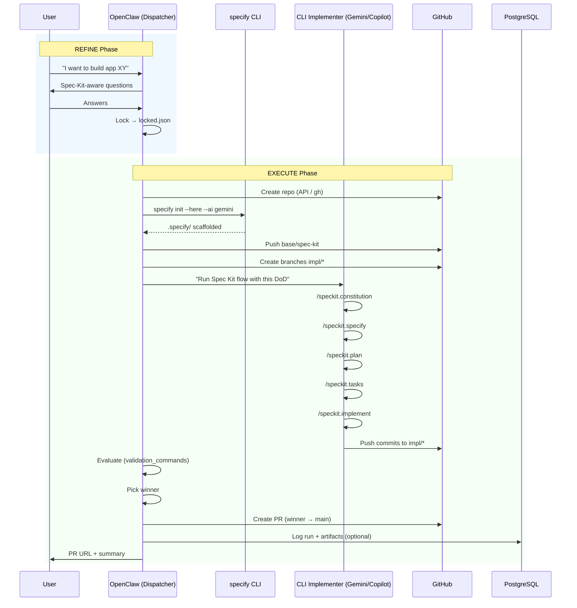

# Spec Kit + OpenClaw + CLI Implementers — Autopilot Architecture

This document defines the **end-to-end autonomous build flow** in janAGI:
OpenClaw refines the intent with the user, bootstraps the repo with Spec Kit,
and delegates all code/spec generation to CLI implementers.

## Guiding Principle

> **OpenClaw talks to the human.**
> **Spec Kit talks to CLI tools.**
> **CLI tools talk to the code.**
> And nobody else talks anywhere else.

---

## Role Separation (Definitive)

### OpenClaw — Dispatcher / Gatekeeper / Jury

OpenClaw is the **Product Owner + Release Manager**. It takes over **everything
the human would otherwise do manually**:

1. **Refine & Lock** — leads a short dialogue with the user, asks Spec-Kit-aware
   questions, locks a `Definition of Done` and a `locked.json` payload.
2. **Bootstrap Repo** — creates the GitHub repo, clones it, runs `specify init`,
   pushes the `base/spec-kit` branch. Adds locked payload as `PROJECT_INTENT.md`.
3. **Invoke CLI Implementers** — starts one or two implementers (Gemini, Copilot,
   Claude, …) and passes them the locked payload + DoD.
4. **Evaluate & Ship** — checks validation commands on each branch, picks a
   winner, runs fix-loop if needed, opens a PR.
5. **n8n Workflow Builder** — can generate n8n workflow JSON and
   create/update/activate workflows in n8n via the REST API
   (`POST /api/v1/workflows`). See [N8N_WORKFLOW_BUILDER.md](N8N_WORKFLOW_BUILDER.md).

**OpenClaw NEVER generates Spec Kit artifacts or application code.**
It does ALL operational/infrastructure work so the human only provides intent.

### CLI Implementers — End-to-End Autonomous Builders

CLI implements **everything else**: constitution, spec, plan, tasks, code, tests.
They follow the Spec Kit sequence strictly and commit after each phase.

### n8n — Visible Orchestrator + API Surface

n8n triggers OpenClaw via HTTP and saves logs. It does NOT run git/specify
commands itself. The workflow is deliberately simple:
`Webhook → Run OpenClaw (HTTP) → Save logs → Respond`

n8n also serves as OpenClaw's **API surface for workflow management**:
- OpenClaw generates workflow JSON → n8n validates + applies it via `POST /api/v1/workflows`
- This lets OpenClaw "click workflows in n8n" programmatically (API-first, not UI)
- n8n API key (`N8N_API_KEY`) is stored as a Coolify secret
- Internal URL: `http://n8n:5678` (same Docker network)
- See [N8N_WORKFLOW_BUILDER.md](N8N_WORKFLOW_BUILDER.md) for full details

---

## Spec Kit Background (from github/spec-kit)

### Installation (on the build runner / VPS)

```bash
# Persistent install (recommended)
uv tool install specify-cli --from git+https://github.com/github/spec-kit.git
specify check

# OR one-shot
uvx --from git+https://github.com/github/spec-kit.git specify init <PROJECT_NAME>
```

### Project initialization

```bash
# New project directory
specify init <PROJECT_NAME> --ai gemini
specify init <PROJECT_NAME> --ai copilot

# Existing repo (current directory)
specify init --here --ai gemini
specify init --here --ai copilot

# Force into non-empty directory
specify init --here --force --ai gemini
```

### Available Slash Commands (Core Sequence)

These are the commands that CLI implementers run **in order**:

| # | Command                 | Purpose                                                     |
|---|-------------------------|-------------------------------------------------------------|
| 1 | `/speckit.constitution` | Create/update project governing principles (`memory/constitution.md`) |
| 2 | `/speckit.specify`      | Define requirements + user stories (`specs/<NNN-feature>/spec.md`)    |
| 3 | `/speckit.plan`         | Technical implementation plan (`plan.md`, `data-model.md`, `contracts/`) |
| 4 | `/speckit.tasks`        | Actionable task breakdown (`tasks.md`)                      |
| 5 | `/speckit.implement`    | Execute tasks: code + tests + validation                    |

Optional enhancement commands:

| Command                | When                     | Purpose                              |
|------------------------|--------------------------|--------------------------------------|
| `/speckit.clarify`     | After specify, before plan | Reduce ambiguity in the spec       |
| `/speckit.checklist`   | After plan               | Quality validation of requirements   |
| `/speckit.analyze`     | After tasks, before implement | Cross-artifact consistency check |

### Spec Kit Project Structure

After `specify init`, the repo looks like:

```
.specify/
├── memory/
│   └── constitution.md          # Project principles (template)
├── scripts/
│   ├── bash/                    # check-prerequisites.sh, setup-plan.sh, etc.
│   └── powershell/              # Windows equivalents
├── templates/
│   ├── commands/                # Slash command definitions
│   │   ├── constitution.md
│   │   ├── specify.md
│   │   ├── clarify.md
│   │   ├── plan.md
│   │   ├── tasks.md
│   │   ├── analyze.md
│   │   ├── checklist.md
│   │   └── implement.md
│   ├── spec-template.md
│   ├── plan-template.md
│   └── tasks-template.md
└── specs/
    └── <NNN-feature-name>/      # Created by /speckit.specify
        ├── spec.md
        ├── plan.md              # Created by /speckit.plan
        ├── research.md          # Created by /speckit.plan
        ├── data-model.md        # Created by /speckit.plan
        ├── contracts/           # Created by /speckit.plan
        ├── quickstart.md        # Created by /speckit.plan
        └── tasks.md             # Created by /speckit.tasks
```

### Supported AI Assistants

`specify init` supports: `claude`, `gemini`, `copilot`, `cursor-agent`, `qwen`,
`opencode`, `codex`, `windsurf`, `kilocode`, `auggie`, `codebuddy`, `amp`,
`shai`, `q` (Amazon Q), `bob` (IBM), `qoder`, `roo`.

---

## The Two-Phase Protocol

### Phase 1: REFINE (Conversational)

OpenClaw leads a dialogue. It asks questions mapped to Spec Kit inputs:

#### Block A — Repo & Operations
- `app_name` — repository/project name
- `visibility` — private / public
- `owner` — GitHub owner (defaults to `GITHUB_OWNER` env)
- `primary` — which implementer: `gemini` / `copilot` / `claude` / `both`

#### Block B — Specification Inputs (for `/speckit.specify`)
- Product description (1–3 sentences: what it does)
- Target user / audience
- Key user scenarios (jobs-to-be-done)
- Acceptance criteria (3–7 items: "done when…")
- Non-goals (what we explicitly won't do now)

#### Block C — Constitution Constraints (for `/speckit.constitution`)
- Testing required? (yes/no, which framework)
- Strict linting? (ruff, eslint, etc.)
- Minimal dependencies?
- Security basics (no secrets in repo, env sample, auth model)
- Preferred libraries / coding style

#### Block D — Plan Inputs (for `/speckit.plan`)
- Template / stack: `fastapi` / `nextjs` / `fullstack`
- Data/storage: none / sqlite / postgres
- Auth model: none / basic / oauth
- Deploy target: local only / docker / VPS

#### Block E — Definition of Done
- `validation_commands` — exact commands (lint / test / build / smoke)
- OpenClaw suggests defaults based on template

**Defaults** (if user doesn't answer within 2 rounds):
- `primary=both`, `visibility=private`, `template=fastapi`
- `testing=pytest+ruff`, `security=no-secrets-in-git`

#### REFINE Output: `locked.json`

```json
{
  "repo": {
    "owner": "HonzaHezina",
    "name": "tatami-booking",
    "visibility": "private"
  },
  "primary": "both",
  "template": "fastapi",
  "project_intent": "Reservation system for tatami rooms with REST API...",
  "definition_of_done": [
    "Repo initialized with Spec Kit.",
    "CLI implementer produced constitution/spec/plan/tasks + implementation.",
    "All validation commands pass."
  ],
  "acceptance_criteria": [
    "GET /health returns 200",
    "POST /reservations creates a booking",
    "pytest passes with >80% coverage"
  ],
  "non_goals": [
    "No payment integration",
    "No frontend (API only for now)"
  ],
  "constitution_constraints": {
    "testing": "pytest + ruff check",
    "minimal_deps": true,
    "security": "no secrets in git"
  },
  "validation_commands": [
    "ruff check .",
    "pytest -q",
    "python -m uvicorn app.main:app --port 8000 & sleep 2 && curl -sf http://localhost:8000/health"
  ]
}
```

### Phase 2: EXECUTE (Autopilot)

Once `locked.json` exists, OpenClaw does everything end-to-end:

```
Step 1: Create GitHub repo (gh repo create / API)
Step 2: Clone → checkout -b base/spec-kit
Step 3: specify init --here --ai <primary>
Step 4: Commit + push base/spec-kit
Step 5: Create branches impl/gemini, impl/copilot (per primary)
Step 6: Invoke CLI implementer(s) with locked payload
Step 7: Evaluate validation_commands on each branch
Step 8: Pick winner (passing tests > more tests > fewer TODOs)
Step 9: Fix-loop if needed (max N=5, CLI does fixing)
Step 10: Create PR winner → main
```

---

## Git Flow

```
main ← PR (winner)
 └── base/spec-kit ← specify init + first commit
      ├── impl/gemini ← all constitution/spec/plan/tasks/implement by Gemini
      └── impl/copilot ← all constitution/spec/plan/tasks/implement by Copilot
```

---

## Log Routing

All logs are stored on disk at:

```
WORK_ROOT/<app_name>/runs/<run_id>/
├── openclaw.log       # Dispatcher decisions, commands, evaluations
├── gemini.log         # Gemini CLI implementer output
├── copilot.log        # Copilot CLI implementer output
├── locked.json        # Frozen spec inputs
├── context.json       # Conversation state (REFINE phase)
└── result.json        # Final outcome {repo_url, winner_branch, pr_url, status}
```

`WORK_ROOT` defaults to `/data/janagi-builds`.

---

## n8n Integration

### Simplified Workflow (1 endpoint)

```
POST /webhook/janagi/spec/openclaw
  Body: { "app_name": "...", "message": "...", "run_id": "..." }
```

Flow: `Webhook → Init Run → Prepare run dir → Call OpenClaw (HTTP) → Parse result → Respond`

OpenClaw decides internally whether it's REFINE (returns questions) or EXECUTE
(returns result). The caller keeps sending messages until it gets a result.

### Environment Variables (n8n / Coolify)

| Variable                     | Example                      | Purpose                    |
|------------------------------|------------------------------|----------------------------|
| `OPENCLAW_BASE_URL`          | `http://openclaw:18789`      | OpenClaw Gateway endpoint  |
| `OPENCLAW_GATEWAY_TOKEN`     | `sk-...`                     | Auth token for Gateway     |
| `GITHUB_TOKEN`               | `ghp_...`                    | GitHub API / gh CLI auth   |
| `GITHUB_OWNER`               | `HonzaHezina`               | Default repo owner         |
| `WORK_ROOT`                  | `/data/janagi-builds`        | Base path for build runs   |
| `OPENCLAW_PROFILE_GEMINI`    | `google:default`             | Gemini CLI profile         |
| `OPENCLAW_PROFILE_COPILOT`   | `github:copilot`             | Copilot CLI profile        |
| `N8N_BASE_URL`               | `http://n8n:5678`            | n8n internal URL (for API) |
| `N8N_API_KEY`                | `n8n-api-key-...`            | n8n REST API key           |

### Postgres Logging (Optional)

The `rag.*` schema already has `runs`, `events`, and `artifacts` tables.
For Spec Kit builds, use:
- `run_type = 'spec_build'`
- Artifacts: `locked.json`, `result.json`, log file paths

---

## Sequence Diagram



---

## Fix-Loop Protocol

When validation commands fail on a branch:

1. CLI implementer creates a **diagnostic summary**:
   - What failed (1 sentence)
   - Most likely cause (1–3 bullets)
   - Fix plan (1–3 steps)
2. CLI implementer fixes + re-runs validation
3. Max **N=5 iterations** per implementer
4. After 5 failures → OpenClaw **escalates to user** with:
   - Summary of all attempts
   - Logs
   - Proposed decision (retry / abort / change spec)

---

## Contracts

System instruction contracts for both roles are maintained separately:

- **OpenClaw Dispatcher**: [`OPENCLAW_DISPATCHER_CONTRACT.md`](OPENCLAW_DISPATCHER_CONTRACT.md) —
  REFINE, EXECUTE, and Combined mode paste-ready system prompts
- **CLI Implementer**: [`CLI_IMPLEMENTER_CONTRACT.md`](CLI_IMPLEMENTER_CONTRACT.md) —
  End-to-end autonomous builder system prompt with template defaults

---

## Practical Recommendations

1. **Pick one primary implementer for MVP** (e.g. Gemini CLI). Use the second
   as a reviewer — it evaluates the PR diff and suggests fixes. Fewer conflicts.
2. **Enforce small commits and mandatory tests.** The test/fix loop is the most
   important safety net against vibe-coding.
3. **OpenClaw must NOT be creative** — it is a pure process executor. If it
   starts writing code or spec content, the architecture breaks.
4. **Context passing:** Always send the full `context.json` to OpenClaw on each
   turn. Do not rely on the model "remembering" — deterministic + auditable.
5. **Treat the OpenClaw gateway as production SSH:** Keep on loopback / internal
   Docker network. Token-protected. Never exposed publicly.
6. **Winner selection heuristic:**
   - Passing tests > failing tests
   - More test files > fewer test files
   - Cleaner README > sparse docs
   - If both fail after 5 iterations → escalate to human
7. **The Reviewer pattern** (alternative to dual-implementer): the winning
   branch stays, the "losing" CLI reviews the PR diff and proposes fixes
   into the winning branch. Fewer merge conflicts.

---

## Combined Mode (Single Endpoint)

For simpler setups, OpenClaw can run REFINE → EXECUTE in one session.
The n8n workflow sends messages to one endpoint; OpenClaw returns questions
while in REFINE and switches to EXECUTE once locked.

- **Endpoint:** `POST /webhook/janagi/spec/flow`
- **Payload:** `{ "app_name": "...", "message": "...", "run_id": "..." }`
- **REFINE response:** `{ "phase": "refine", "needs_input": true, "questions": [...] }`
- **EXECUTE response:** `{ "phase": "execute", "status": "success", "pr_url": "..." }`

See OPENCLAW_DISPATCHER_CONTRACT.md § 5 for the Combined system prompt.

---

## n8n Workflow Builder (OpenClaw → n8n API)

OpenClaw can also **create and manage n8n workflows programmatically**.
This is the most robust way to "click workflows in n8n" — via API, not UI.

### How It Works

1. User tells OpenClaw (via Telegram or webhook): "Create a workflow that..."
2. OpenClaw generates a valid n8n workflow JSON (`name` / `nodes` / `connections`)
3. n8n validates the JSON and applies it via `POST /api/v1/workflows`
4. Optionally activates the workflow via `PATCH /api/v1/workflows/:id`

### Networking (Coolify)

| From      | To   | URL                        |
|-----------|------|----------------------------|
| OpenClaw  | n8n  | `http://n8n:5678`          |
| n8n       | OpenClaw | `http://openclaw:18789` |

Both must be on the same Coolify Docker network.

### n8n API Endpoints Used

| Method | Endpoint                         | Purpose                    |
|--------|----------------------------------|----------------------------|
| POST   | `/api/v1/workflows`              | Create new workflow        |
| PATCH  | `/api/v1/workflows/:id`          | Update existing workflow   |
| PATCH  | `/api/v1/workflows/:id/activate` | Activate workflow          |
| GET    | `/api/v1/workflows`              | List all workflows         |
| DELETE | `/api/v1/workflows/:id`          | Delete workflow            |

All calls require `X-N8N-API-KEY` header.

### Setup Checklist

1. In n8n UI: **Settings → API → Create API key**
2. Store `N8N_API_KEY` as a Coolify secret
3. Set `N8N_BASE_URL=http://n8n:5678` in OpenClaw env
4. Ensure both services share the same Docker network
5. (Optional) Enable `/v1/responses` in OpenClaw config if using that endpoint

### Security Rules

- `N8N_API_KEY` stays in Coolify secrets — never in prompts or logs
- OpenClaw gateway stays internal-only (no public port)
- Use Action Draft approval gate for: workflow activation, credential edits, deletions
- See [SECURITY.md](SECURITY.md) and [ACTION_DRAFT_PROTOCOL.md](ACTION_DRAFT_PROTOCOL.md)

### Recommended Pattern

n8n is always the one calling its own API (safety gate):

```
Webhook (user request)
  → HTTP Request to OpenClaw (generate workflow JSON)
  → Code node (validate JSON)
  → HTTP Request to n8n API (create workflow)
  → Respond (workflow ID + name)
```

OpenClaw calling n8n API directly is possible but less safe (no validation gate).
Use only with strict policy + approval gating.

Full details: [N8N_WORKFLOW_BUILDER.md](N8N_WORKFLOW_BUILDER.md)

---

## Related Files

| File | Purpose |
|------|---------|
| `ops/n8n/spec_kit_workflow.json` | n8n workflow JSON for the Spec Kit build endpoint |
| `ops/scripts/openclaw_spec_execute.sh` | Execute script template (used by OpenClaw in EXECUTE phase) |
| `ops/docs/OPENCLAW_TURBO.md` | OpenClaw HTTP integration details |
| `ops/docs/N8N_WORKFLOW_BUILDER.md` | Workflow Builder: OpenClaw generates n8n workflows via API |
| `ops/docs/ARCHITECTURE.md` | System-level architecture |
